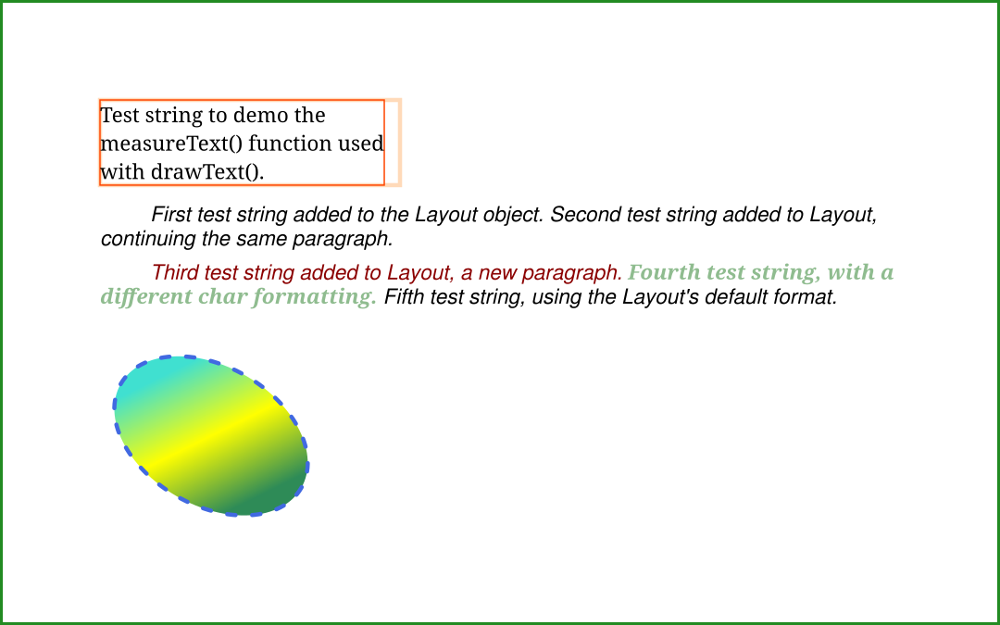
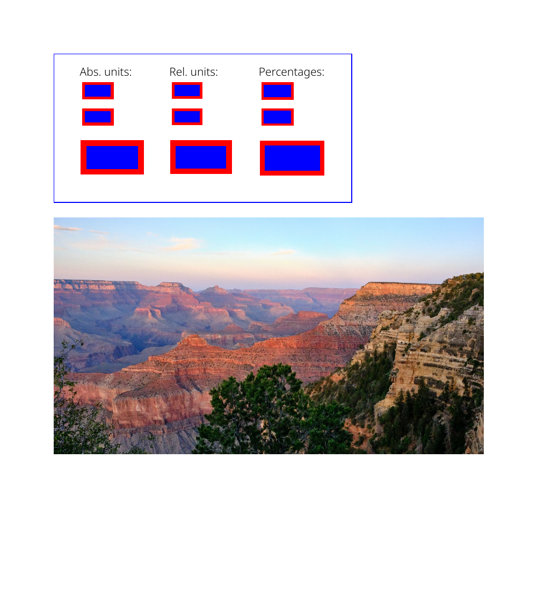

# Getting started with DsPdfJS

A minimal React + TypeScript + Vite app demonstrating [**DsPdfJS** (`@mescius/ds-pdf`)](https://www.npmjs.com/package/@mescius/ds-pdf): connecting to the DsPdfJS WebAssembly (Wasm) module and drawing the same text and graphics to a **PDF page**, an **SVG document**, and a **bitmap saved as PNG**.

You can [try DsPdfJS live](https://developer.mescius.com/document-solutions/javascript-pdf-api/demos/getting-started) without installing anything.

DsPdfJS exposes a single drawing API that you can target at a PDF page, a vector SVG document, or a raster bitmap. The same drawing code produces all three outputs. The image below was generated by the **Draw SVG** button; **Draw PDF** and **Draw PNG** render identical content to a PDF and a bitmap:



The second page of the generated PDF draws an existing SVG file and a JPEG photo:



## What it shows

- Connecting to and disconnecting from the DsPdfJS Wasm module (`connectDsPdf`, `DsPdfConfig.wasmUrl`).
- Managing temporary DsPdfJS objects with the `@withObjectManager` decorator.
- Generating a "Hello World" PDF from scratch (`Demos.simplePdf`).
- Using a single `drawContent(ctx: DrawingContext)` method to render identical output to a PDF page (`PdfContext`), an SVG document (`SvgContext`), and a bitmap (`BmpContext`): measured and word-wrapped text, multi-format paragraphs via `Layout`, custom TTF fonts, transforms, and gradient-filled shapes.
- Drawing an existing SVG file and a JPEG image onto a PDF page.

## Running

Prerequisites: [Node.js](https://nodejs.org/) (with npm).

```bash
npm install
npm run dev
```

Open `http://localhost:5173` and click **Simple PDF**, **Draw PDF**, **Draw SVG**, or **Draw PNG**. Each button generates an output file in the browser and downloads it.

In VS Code you can instead press **F5** — the included `.vscode/launch.json` and `tasks.json` start Vite and launch Chrome with the debugger attached.

## Notes

- The sample points `DsPdfConfig.wasmUrl` at `node_modules/@mescius/ds-pdf/assets/DsPdf.wasm`, which the Vite dev server serves directly. For a production build (`npm run build`), copy `DsPdf.wasm` to the `public` folder (or another deployed location) and update `wasmUrl` accordingly.
- Without a license key, DsPdfJS runs in trial mode and some PDF loading/generation features may be restricted. Set your key in `Demos.connect()` via `await DsPdfConfig.setLicenseKey("YOUR_KEY")`.
- The fonts and images used by the demos are in the `public` folder.
