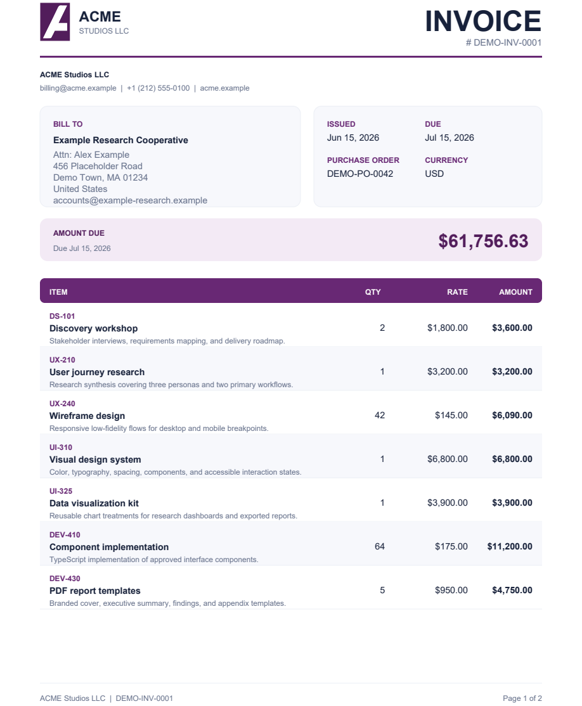

# Generate a PDF invoice from JSON with DsPdfJS

A Node.js + TypeScript command-line sample that converts structured JSON into a multi-page PDF invoice using [Document Solutions for PDF JS (DsPdfJS)](https://www.npmjs.com/package/@mescius/ds-pdf).



This sample is server-side: it reads files from disk, initializes the DsPdfJS WebAssembly module in Node.js, generates the document, and writes the resulting PDF to the `output` folder.

## What it shows

- Configuring and connecting to the DsPdfJS WebAssembly module in Node.js.
- Managing Wasm-backed resources explicitly with `ObjectManager`.
- Reading and validating invoice data from JSON.
- Drawing a vector SVG logo, text, shapes, cards, and tabular content.
- Measuring text to calculate variable-height line-item rows.
- Adding pages automatically and repeating the invoice and table headers.
- Calculating currency totals, discounts, and tax with `Intl.NumberFormat`.
- Adding PDF metadata and `Page X of Y` footers after pagination is complete.
- Accepting optional input and output file paths for reuse in scripts or services.

## Requirements

- Node.js 20 or later
- npm

## Run the sample

```bash
npm install
npm run generate
```

The command builds the TypeScript source and creates `output/invoice.pdf`:

The default input is [`data/invoice.json`](./data/invoice.json). It contains enough items to fill 2 pages, demonstrating automatic pagination and repeated headers.

## Use custom JSON and output paths

Build the sample, then pass the input and output paths to the compiled script:

```bash
npm run build
node dist/generate-invoice.js path/to/invoice.json path/to/invoice.pdf
```

Relative paths are resolved from the current working directory. Missing output directories are created automatically.

The JSON structure is straightforward:

```json
{
  "invoiceNumber": "DEMO-INV-0001",
  "issueDate": "2026-06-15",
  "dueDate": "2026-07-15",
  "currency": "USD",
  "seller": {
    "name": "ACME Studios LLC",
    "address": ["123 Example Avenue", "Sample City, NY 10001"],
    "email": "billing@acme.example"
  },
  "customer": {
    "name": "Example Research Cooperative",
    "address": ["456 Placeholder Road", "Demo Town, MA 01234"],
    "email": "accounts@example-research.example"
  },
  "items": [
    {
      "sku": "DS-101",
      "description": "Discovery workshop",
      "quantity": 2,
      "unitPrice": 1800
    }
  ],
  "discount": 0,
  "taxRate": 0.0825
}
```

## License key

Without a license key, DsPdfJS runs in trial mode and adds an evaluation notice to generated PDFs. To apply a key without placing it in source control, set `DSPDF_LICENSE_KEY` before running the sample.

PowerShell:

```powershell
$env:DSPDF_LICENSE_KEY = "YOUR_KEY"
npm run generate
```

Bash:

```bash
DSPDF_LICENSE_KEY="YOUR_KEY" npm run generate
```

## Project structure

```text
json-to-pdf-invoice/
|-- assets/acme-logo.svg
|-- data/invoice.json
|-- screenshots/invoice-preview.png
|-- src/generate-invoice.ts
|-- package.json
`-- tsconfig.json
```

The ACME Studios identity and invoice data are fictional and included solely for demonstration.
