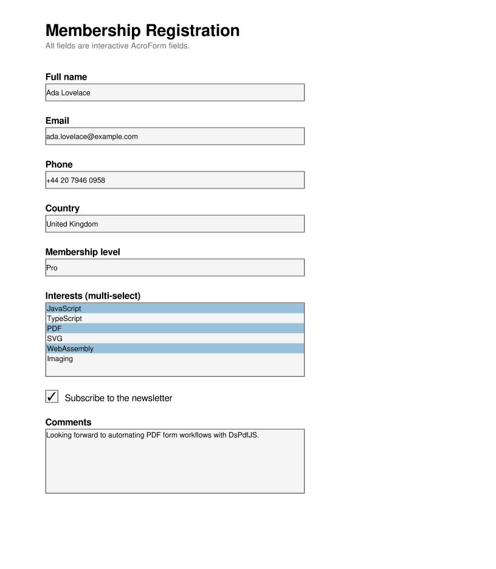

# Fill and flatten PDF forms with JavaScript and DsPdfJS

A React + TypeScript + Vite app demonstrating [**DsPdfJS** (`@mescius/ds-pdf`)](https://www.npmjs.com/package/@mescius/ds-pdf): loading an existing **AcroForm** PDF, filling its fields from a JSON file, and saving the result either as an **editable** form or as a **flattened** PDF.

You can [try DsPdfJS live](https://developer.mescius.com/document-solutions/javascript-pdf-api/demos/getting-started) without installing anything.

The sample loads a blank registration form (`public/registration-form.pdf`), reads values from `public/form-data.json`, and fills text fields, a checkbox, two combo boxes (a fixed drop-down and an editable one), and a multi-select list box. The image below is the filled form:



## Editable vs. flattened output

This is the key idea the sample demonstrates. Filling a form is the same in both cases — the difference is only in how you save the result.

**Editable output** keeps the interactive AcroForm. The fields still exist in the saved PDF, so anyone who opens it in a PDF viewer can click into them and change the values. This is what you want when the document is a *draft* that a person still needs to review, correct, or complete, or when downstream software needs to read the field values back out programmatically. In the sample, `Demos.fillEditable()` just calls `doc.savePdf()` after filling, leaving the AcroForm untouched.

**Flattened output** bakes the field appearances into the static page content and removes the interactive AcroForm. The page *looks* exactly the same, but the values are now ordinary text and graphics — there are no form fields left to edit. This is what you want for a *final* document: an archived record, a PDF you email or print, or a file you hand off to someone who should not (or whose viewer cannot) change the values. Flattening also makes the appearance consistent across every viewer and printer, since it no longer depends on the viewer rendering the form fields.

DsPdfJS does not have a one-call `flatten()` method; instead you draw each page — *including* its form-field widgets — onto a fresh page. `Demos.flatten()` creates a new `PdfDocument` and, for every source page, calls [`PdfPage.draw`](https://developer.mescius.com/document-solutions/javascript-pdf-api/api/README) with `drawFormFields: true`:

```ts
const flatDoc = new PdfDocument();
for (let i = 0; i < filledDoc.pages.count; i++) {
    const src = filledDoc.pages.getAt(i);
    const ctx = flatDoc.newPageContext({ width: src.width, height: src.height });
    src.draw(ctx, 0, 0, src.width, src.height, {
        drawFormFields: true,
        drawAnnotations: true
    });
}
const bytes = flatDoc.savePdf(); // no AcroForm in this document
```

The new document has the field values painted into the page and an empty AcroForm.

## What it shows

- Loading an existing PDF with `PdfDocument.load()`.
- Reading the document's AcroForm via `doc.acroForm.fields` and looking fields up by name with `findByName()`.
- Filling each field type from JSON:
  - **Text fields** (`TextField`, including a multi-line one) — set `field.value`.
  - **Check box** (`CheckBoxField`) — set `field.checked` from a boolean.
  - **Combo boxes** (`ComboBoxField`) — select an option by matching its text/value (`field.selectedIndex`), or, for an editable combo box, store typed text (`field.text`).
  - **List box** (`ListBoxField`, multi-select) — select several options with `field.selectedIndexes`.
- Saving an **editable** filled form (`Demos.fillEditable`).
- Saving a **flattened** copy by drawing pages with `drawFormFields` (`Demos.fillAndFlatten`).

## The form data

`public/form-data.json` maps field names to values:

```json
{
  "fullName": "Ada Lovelace",
  "email": "ada.lovelace@example.com",
  "phone": "+44 20 7946 0958",
  "country": "United Kingdom",
  "membership": "Pro",
  "interests": ["JavaScript", "PDF", "WebAssembly"],
  "newsletter": true,
  "comments": "Looking forward to automating PDF form workflows with DsPdfJS."
}
```

Each key is the name of a field in `registration-form.pdf`; the fill code (`Demos.fillForm`) dispatches on the field's type, so keys with no matching field are simply ignored.

## Running

Prerequisites: [Node.js](https://nodejs.org/) (with npm).

```bash
npm install
npm run dev
```

Open `http://localhost:5173` and click:

- **Blank Form** — download the unfilled template (`registration-form.pdf`).
- **Fill (editable)** — fill the fields and download an editable form (`registration-filled.pdf`).
- **Fill & Flatten** — fill the fields and download a flattened, non-editable PDF (`registration-flattened.pdf`).

Open the editable and flattened downloads side by side: they look the same, but only the editable one lets you click into the fields.

In VS Code you can instead press **F5** — the included `.vscode/launch.json` and `tasks.json` start Vite and launch Chrome with the debugger attached.

## Notes

- The sample points `DsPdfConfig.wasmUrl` at `node_modules/@mescius/ds-pdf/assets/DsPdf.wasm`, which the Vite dev server serves directly. For a production build (`npm run build`), copy `DsPdf.wasm` to the `public` folder (or another deployed location) and update `wasmUrl` accordingly.
- Without a license key, DsPdfJS runs in trial mode: a notice is drawn on generated pages and loading/generation may be limited. Set your key in `Demos.connect()` via `await DsPdfConfig.setLicenseKey("YOUR_KEY")`.
- The blank form was generated with `tools/create-form-template.mjs`, which also demonstrates the *creation* side of AcroForms (adding text, checkbox, combo box, and list box fields). Re-run it with `npm run make-form` only if you want to regenerate or change the template.
