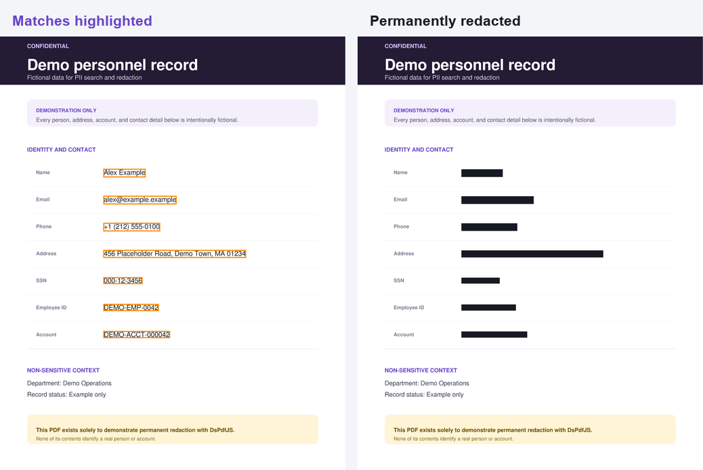

# Find and permanently redact PII with DsPdfJS

This sample finds common personally identifiable information (PII) in a PDF,
lets the user choose what to remove, and applies permanent redactions with
[Document Solutions for PDF JS (DsPdfJS)](https://www.npmjs.com/package/@mescius/ds-pdf).



Note that the final PDF does not merely draw black rectangles over sensitive text.
`PdfDocument.redact()` completely removes the marked content from the document.
The sample confirms this by extracting text again and checking that all selected values are gone.

## What it shows

- Loading a PDF and extracting its text with `PdfDocument.getText()`.
- Detecting email addresses, phone numbers, SSN-shaped values, and demo identifiers with small regular expressions.
- Accepting semicolon-separated exact values for names, addresses, or other document-specific text.
- Locating every occurrence with `PdfDocument.findText()` and using the returned bounds.
- Creating `RedactAnnotation` objects from those bounds.
- Previewing matches as highlighted redact annotations.
- Permanently applying selected annotations with `PdfDocument.redact()`.
- Verifying that the selected values no longer appear in extracted text.
- Saving the redacted PDF and multi-page PNG before/after previews entirely in the browser.

## Run the sample

```bash
npm install
npm run dev
```

Open the local URL printed by Vite. The sample loads `public/pii-sample.pdf` automatically; you can also upload another PDF.

The `predev` script copies the `DsPdf.wasm` file shipped by `@mescius/ds-pdf` into `public` (the copied file is ignored by Git).
The same step runs automatically before a production build:

```bash
npm run build
```

## How the sample works

1. Extract all document text.
2. Detect common patterns and add any exact terms entered by the user.
3. Call `findText()` for each unique value to obtain page indexes and text bounds.
4. Let the user select which values to redact.
5. Create a `RedactAnnotation` for each occurrence and call `doc.redact(annotations)`.
6. Extract text again and report how many selected values were successfully removed.

The bundled PDF contains only obvious demonstration data such as `Alex Example`, `456 Placeholder Road`, an example SSN,
email addresses and identifiers. Regenerate it after editing [`tools/create-pii-sample.mjs`](./tools/create-pii-sample.mjs) with:

```bash
npm run make-document
```

## Detection scope

The regular expressions in this sample are intentionally simple and meant to show how search results can be used with the redaction API.
They are not intended as a complete PII detection solution. Production applications should use detection and review processes appropriate
for their documents and requirements.

## License key

Without a license key, DsPdfJS runs in trial mode and adds an evaluation notice to generated or rendered output.
To use a key, call `DsPdfConfig.setLicenseKey()` before `connectDsPdf()` in [`src/Demos.ts`](./src/Demos.ts).
